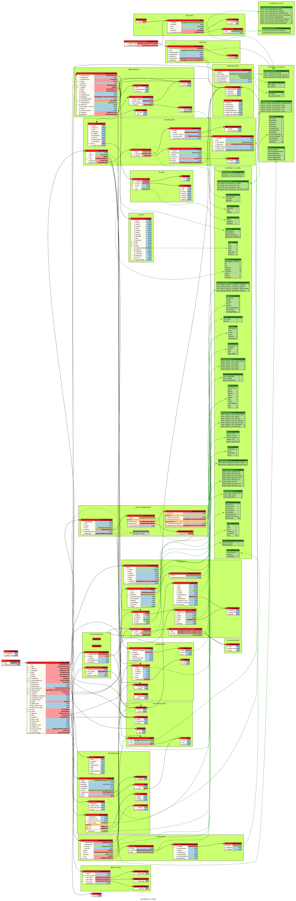

# EVE Device API

This is the "Device API", for communications between an [lf-edge eve](https://github.com/lf-edge/eve) edge device
and a controller.

See [https://www.lfedge.org/projects/eve/](https://www.lfedge.org/projects/eve/)

This directory defines the API itself as message definitions, documentation and language-specific bindings.

## Contents

### Documentation

Documentation is in markdown files in this directory, specifically:

* General overview and how to use and build in this [README.md](./README.md)
* The protocol in [APIv2.md](./APIv2.md)
* Local profile overrides in [PROFILE.md](./PROFILE.md)
* Object signing in [OBJECT-SIGNING.md](./OBJECT-SIGNING.md)

### Message definitions

The message definitions are in [protobufs](https://developers.google.com/protocol-buffers/) in
the [proto](./proto) subdirectory.

### Language bindings

Language bindings are generated from the protobufs, in language-specific directories:

* [go](./go)
* [python](./python)

## Using the language-specific bindings

To use the language-specific bindings, import them as libraries to your appropriate language.
For example, in go:

```go
import (
    "github.com/lf-edge/eve-api/go/config"
)
```

## Development

To make changes to this API, you:

1. Edit the specific `.proto` files in the [proto](./proto) directory, or create new ones, as desired.
1. Run `make proto` to generate the language-specific bindings and visualizations.
1. Commit the changes to the `.proto` files and the generated files.

The Pull Request process for this repository will regenerate the language-specific bindings and visualizations,
and check that no files are missing from the repository.

You can do the above inside a ready-to-run docker container with all of the
prerequisites (recommended), or you can install the prerequisites on your
local machine.

Either way, you run:

```bash
make proto
```

### Language-Specific Bindings

To generate just a single language, run:

```bash
make go
# or
make python
```

### Visualizations

In addition to the language-specific libraries, `make proto` generates visualizations of the protobuf structure,
beginning with the root of an edge device config. These are
available as `.svg`, `.dot` and `.png` as below. Click to zoom in.

* [](./images/devconfig.png)
* [svg](./images/devconfig.svg)
* [dot](./images/devconfig.dot)

### Build Environment

The above `make` commands can be run either in a [devcontainer](http://devcontainers.github.io)
or locally on your machine.

When run in a devcontainer, all of the prerequsities and their correct versions are set up for you.

#### Devcontainer

To run inside a devcontainer (recommended), use one of the tools that recognizes and supports devcontainers
to provide a development-time environment. These include [VS Code](https://containers.dev/supporting#dev-containers),
[GitHub Codespaces](https://containers.dev/supporting#github-codespaces), and the
[devcontainers CLI](https://containers.dev/supporting#devcontainer-cli).

If using the CLI, run:

```bash
devcontainer --workspace-folder . up
devcontainer exec --workspace-folder . make proto
```

#### Local

If running locally, you need to install the prerequisites yourself.

* [protoc](https://grpc.io/docs/protoc-installation/)
* [protodot](https://github.com/seamia/protodot)
* [dot](https://graphviz.org/docs/layouts/dot/)

